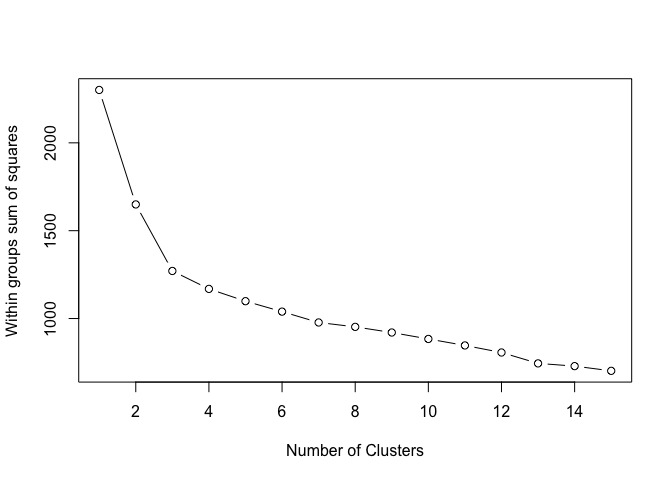
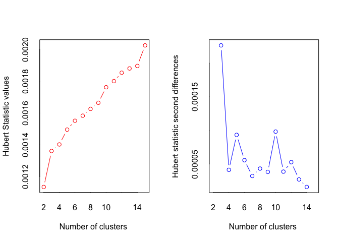
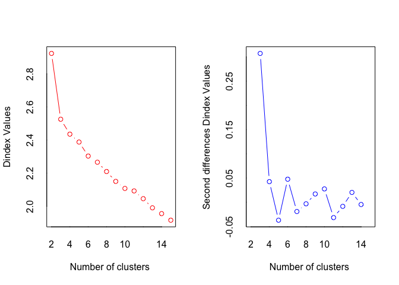
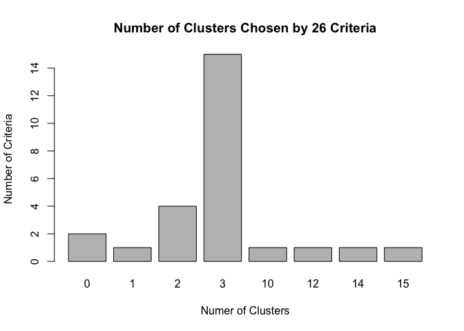
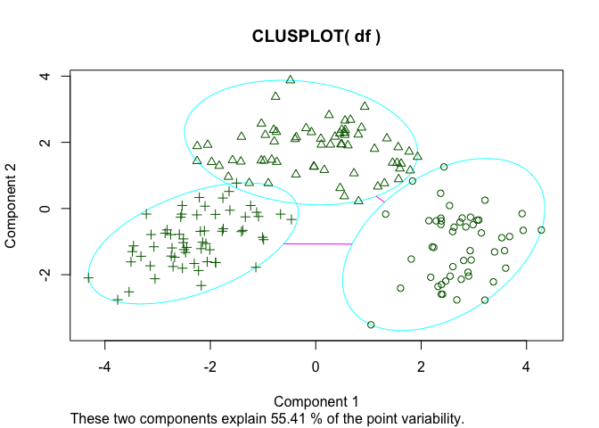

Clustering the Wine data-set
================

GitHub Documents
----------------

This is an R Markdown format used for publishing markdown documents to GitHub. When you click the **Knit** button all R code chunks are run and a markdown file (.md) suitable for publishing to GitHub is generated.

Including Code
--------------

You can include R code in the document as follows:

### Exercise 0: EXPLORE the data

install these packages if you don't have them already install.packages(c("cluster", "rattle","NbClust"))

Now load the data and look at the first few rows

    ##   Type Alcohol Malic  Ash Alcalinity Magnesium Phenols Flavanoids
    ## 1    1   14.23  1.71 2.43       15.6       127    2.80       3.06
    ## 2    1   13.20  1.78 2.14       11.2       100    2.65       2.76
    ## 3    1   13.16  2.36 2.67       18.6       101    2.80       3.24
    ## 4    1   14.37  1.95 2.50       16.8       113    3.85       3.49
    ## 5    1   13.24  2.59 2.87       21.0       118    2.80       2.69
    ## 6    1   14.20  1.76 2.45       15.2       112    3.27       3.39
    ##   Nonflavanoids Proanthocyanins Color  Hue Dilution Proline
    ## 1          0.28            2.29  5.64 1.04     3.92    1065
    ## 2          0.26            1.28  4.38 1.05     3.40    1050
    ## 3          0.30            2.81  5.68 1.03     3.17    1185
    ## 4          0.24            2.18  7.80 0.86     3.45    1480
    ## 5          0.39            1.82  4.32 1.04     2.93     735
    ## 6          0.34            1.97  6.75 1.05     2.85    1450

### Exercise 1: TRANSFORM and LOAD :

Remove the first column from the data and scale it using the scale() function

    ## 'data.frame':    178 obs. of  13 variables:
    ##  $ Alcohol        : num  14.2 13.2 13.2 14.4 13.2 ...
    ##  $ Malic          : num  1.71 1.78 2.36 1.95 2.59 1.76 1.87 2.15 1.64 1.35 ...
    ##  $ Ash            : num  2.43 2.14 2.67 2.5 2.87 2.45 2.45 2.61 2.17 2.27 ...
    ##  $ Alcalinity     : num  15.6 11.2 18.6 16.8 21 15.2 14.6 17.6 14 16 ...
    ##  $ Magnesium      : int  127 100 101 113 118 112 96 121 97 98 ...
    ##  $ Phenols        : num  2.8 2.65 2.8 3.85 2.8 3.27 2.5 2.6 2.8 2.98 ...
    ##  $ Flavanoids     : num  3.06 2.76 3.24 3.49 2.69 3.39 2.52 2.51 2.98 3.15 ...
    ##  $ Nonflavanoids  : num  0.28 0.26 0.3 0.24 0.39 0.34 0.3 0.31 0.29 0.22 ...
    ##  $ Proanthocyanins: num  2.29 1.28 2.81 2.18 1.82 1.97 1.98 1.25 1.98 1.85 ...
    ##  $ Color          : num  5.64 4.38 5.68 7.8 4.32 6.75 5.25 5.05 5.2 7.22 ...
    ##  $ Hue            : num  1.04 1.05 1.03 0.86 1.04 1.05 1.02 1.06 1.08 1.01 ...
    ##  $ Dilution       : num  3.92 3.4 3.17 3.45 2.93 2.85 3.58 3.58 2.85 3.55 ...
    ##  $ Proline        : int  1065 1050 1185 1480 735 1450 1290 1295 1045 1045 ...

The type field is removed and we have also scaled the data Scaling is data-mean/(Std. Deviation)

``` r
head(df)
```

    ##     Alcohol       Malic        Ash Alcalinity  Magnesium   Phenols
    ## 1 1.5143408 -0.56066822  0.2313998 -1.1663032 1.90852151 0.8067217
    ## 2 0.2455968 -0.49800856 -0.8256672 -2.4838405 0.01809398 0.5670481
    ## 3 0.1963252  0.02117152  1.1062139 -0.2679823 0.08810981 0.8067217
    ## 4 1.6867914 -0.34583508  0.4865539 -0.8069748 0.92829983 2.4844372
    ## 5 0.2948684  0.22705328  1.8352256  0.4506745 1.27837900 0.8067217
    ## 6 1.4773871 -0.51591132  0.3043010 -1.2860793 0.85828399 1.5576991
    ##   Flavanoids Nonflavanoids Proanthocyanins      Color        Hue  Dilution
    ## 1  1.0319081    -0.6577078       1.2214385  0.2510088  0.3611585 1.8427215
    ## 2  0.7315653    -0.8184106      -0.5431887 -0.2924962  0.4049085 1.1103172
    ## 3  1.2121137    -0.4970050       2.1299594  0.2682629  0.3174085 0.7863692
    ## 4  1.4623994    -0.9791134       1.0292513  1.1827317 -0.4263410 1.1807407
    ## 5  0.6614853     0.2261576       0.4002753 -0.3183774  0.3611585 0.4483365
    ## 6  1.3622851    -0.1755994       0.6623487  0.7298108  0.4049085 0.3356589
    ##       Proline
    ## 1  1.01015939
    ## 2  0.96252635
    ## 3  1.39122370
    ## 4  2.32800680
    ## 5 -0.03776747
    ## 6  2.23274072

#### Now we'd like to cluster the data using K-Means.

How do we decide how many clusters to use if you don't know that already? We'll try two methods.

### Method 1: A plot of the total within-groups sums of squares

plotted against against the number of clusters in a K-means solution can be helpful. A bend in the graph can suggest the appropriate number of clusters. \`\`\`

``` r
wssplot <- function(data, nc=15, seed=1234){
                  wss <- (nrow(data)-1)*sum(apply(data,2,var))
                      for (i in 2:nc){
                set.seed(seed)
                    wss[i] <- sum(kmeans(data, centers=i)$withinss)}
                    
              plot(1:nc, wss, type="b", xlab="Number of Clusters",
                            ylab="Within groups sum of squares")
              
}
```

#### Scree-plot

``` r
wssplot(df)
```



### Exercise 2: Analyze the plot

##### \* How many clusters does this method suggest?

     Ans: 3 Clusters. The difference going from 1-3 is more than going from 3-4 on the Scree plot

##### \* Why does this method work? What's the intuition behind it?

     Ans: As the number of clusters increases the clusters are closer and more compact

##### \* Look at the code for wssplot() and figure out how it works

     Ans: For 1st iteration sum of variances of the df   is computed and
            multiplied by number of attributes : Entire cluster sum of squares is calulated
          For the next iteration i ... nc, the kmeans  with k = i is computed and its withinss is summed up

``` r
print(" It looks like 3 -> 4 seems to be where the elbow is") 
```

    ## [1] " It looks like 3 -> 4 seems to be where the elbow is"

``` r
print(" The drop in difference  is the most between 1 and 3 clusters")
```

    ## [1] " The drop in difference  is the most between 1 and 3 clusters"

### Method 2: Use the NbClust library, which runs many experiments

#### and gives a distribution of potential number of clusters.

``` r
library(NbClust)
set.seed(1234)
nc <- NbClust(df, min.nc=2, max.nc=15, method="kmeans")
```



    ## *** : The Hubert index is a graphical method of determining the number of clusters.
    ##                 In the plot of Hubert index, we seek a significant knee that corresponds to a 
    ##                 significant increase of the value of the measure i.e the significant peak in Hubert
    ##                 index second differences plot. 
    ## 



    ## *** : The D index is a graphical method of determining the number of clusters. 
    ##                 In the plot of D index, we seek a significant knee (the significant peak in Dindex
    ##                 second differences plot) that corresponds to a significant increase of the value of
    ##                 the measure. 
    ##  
    ## ******************************************************************* 
    ## * Among all indices:                                                
    ## * 4 proposed 2 as the best number of clusters 
    ## * 15 proposed 3 as the best number of clusters 
    ## * 1 proposed 10 as the best number of clusters 
    ## * 1 proposed 12 as the best number of clusters 
    ## * 1 proposed 14 as the best number of clusters 
    ## * 1 proposed 15 as the best number of clusters 
    ## 
    ##                    ***** Conclusion *****                            
    ##  
    ## * According to the majority rule, the best number of clusters is  3 
    ##  
    ##  
    ## *******************************************************************



    ## [1] "The NbClust method below also came up with number of clusters to be 3"

Exercise 3: NbClust method analysis
===================================

How many clusters does this method suggest?

    ## [1] " Accordingto NbClust method it was 3"

### Exercise 4: Perform K-means Clustering with k=3

#### Once you've picked the number of clusters, run k-means

##### using this number of clusters. Output the result of calling kmeans()

##### into a variable fit.km

``` r
# fit.km <- kmeans( ... )
fit.km <- kmeans(df, 3, nstart=20)
# Now we want to evaluate how well this clustering does.
```

### Exercise 5: Compare kmeans fit\_km with Wine types

#### using the table() function, show how the clusters in fit.km\(clusters #### compares to the actual wine types in wine\)Type. Would you consider this a good

#### clustering

``` r
table(fit.km$cluster, as.factor(wine$Type))
```

    ##    
    ##      1  2  3
    ##   1  0  3 48
    ##   2  0 65  0
    ##   3 59  3  0

Wine Types 1 and 3 are in perfect agreement Wine Type 2 is mostly well clustered but not in perfect agreement

### Exercise 6: Visualize

#### \* Visualize these clusters using function clusplot() from the cluster library

#### \* Would you consider this a good clustering?

#### Ans: No, the inter cluster distance is small and the Diameters are large

clusplot( ... )



Note that the `echo = FALSE` parameter was added to the code chunk to prevent printing of the R code that generated the plot. Contact: at k.rajesh.jATg..l.com
